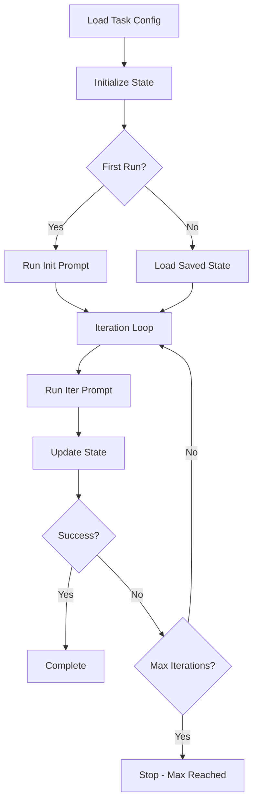

# Claude Long-Running Executor Framework

A universal framework for executing long-running, iterative tasks with Claude Agent SDK. Based on Anthropic's official [autonomous-coding](https://github.com/anthropics/claude-quickstarts/tree/main/autonomous-coding) quickstart.

## Overview

This framework provides a **ReACT-style loop execution system** for Claude Code tasks that require multiple iterations to complete, such as:

- 🔄 **PR Review Loops**: Review → Fix → Re-review until approved
- 🧪 **Test-Fix Cycles**: Run tests → Fix failures → Verify
- ♻️ **Refactoring Iterations**: Analyze → Refactor → Validate
- 🎯 **Custom Workflows**: Any task requiring iterative refinement

## Key Features

- ✅ **Task-based Configuration**: Define tasks via JSON + Markdown prompts
- ✅ **Success Condition Detection**: Flexible, extensible condition checking
- ✅ **State Persistence**: Resume from interruptions
- ✅ **Official Architecture**: Built on Anthropic's autonomous-coding foundation
- ✅ **Type-Safe**: Full Python type annotations
- ✅ **Production-Ready**: Comprehensive error handling and logging

## Architecture

```
claude-long-runner/
├── agent.py              # Session execution (from official project)
├── client.py             # Claude Agent SDK wrapper (from official project)
├── security.py           # Bash command validation (from official project)
├── task_config.py        # Task configuration loader
├── success_checker.py    # Success condition detection
├── state_manager.py      # State persistence manager
├── long_run_executor.py  # Main execution orchestrator
└── tasks/
    ├── pr_review/        # PR review task
    └── template/         # Template for new tasks
```

## Quick Start

### Prerequisites

- Python 3.10+
- Claude Agent SDK
- Node.js 18+ (for Claude Code CLI)
- `ANTHROPIC_API_KEY` environment variable

### Installation

```bash
# Navigate to the project
cd /path/to/claude-long-runner

# Install dependencies
pip install -r requirements.txt
```

### Run a Task

```bash
# PR Review example
python long_run_executor.py \
  --task pr_review \
  --params '{"pr_number": 453}' \
  --max-iterations 3 \
  --project-dir /path/to/project

# Resume interrupted task
python long_run_executor.py --task pr_review --resume
```

## Usage

### Basic Command

```bash
python long_run_executor.py --task <task_name> --params '<json_params>'
```

### Command-Line Options

| Option | Required | Description |
|--------|----------|-------------|
| `--task` | Yes | Task name (directory in `tasks/`) |
| `--params` | Yes | JSON string with task parameters |
| `--max-iterations` | No | Maximum iterations (default: 5) |
| `--project-dir` | No | Working directory (default: `.`) |
| `--model` | No | Claude model (default: `claude-sonnet-4-5-20250929`) |
| `--resume` | No | Resume from saved state |

### Creating Custom Tasks

1. **Copy the template**:
   ```bash
   cp -r tasks/template tasks/my_task
   ```

2. **Configure `tasks/my_task/task.json`**:
   ```json
   {
     "name": "my_task",
     "description": "What this task does",
     "state_file": "my_task_state.json",
     "initial_state": {
       "param1": null
     },
     "success_conditions": [
       {"type": "text_contains", "text": "success"}
     ],
     "delay_seconds": 3
   }
   ```

3. **Write prompts**:
   - `tasks/my_task/init_prompt.md` - Initial instructions
   - `tasks/my_task/iter_prompt.md` - Iteration instructions

4. **Run it**:
   ```bash
   python long_run_executor.py --task my_task --params '{"param1": "value"}'
   ```

See [tasks/template/README.md](tasks/template/README.md) for detailed instructions.

## Success Conditions

Configure when a task should stop by defining success conditions in `task.json`:

### Available Condition Types

| Type | Parameters | Description |
|------|------------|-------------|
| `text_contains` | `text` | Response contains specific text |
| `text_not_contains` | `text` | Response doesn't contain text |
| `state_equals` | `key`, `value` | State field equals value |
| `state_not_equals` | `key`, `value` | State field doesn't equal value |
| `iteration_limit` | `max` | Stop after N iterations |

### Example

```json
{
  "success_conditions": [
    {
      "type": "text_contains",
      "text": "no critical issues"
    },
    {
      "type": "state_equals",
      "key": "review_passed",
      "value": true
    }
  ]
}
```

## How It Works

### Execution Flow



### Components

**TaskConfig**: Loads task definition from `tasks/<name>/`
- `task.json` - Configuration
- `init_prompt.md` - Initial prompt template
- `iter_prompt.md` - Iteration prompt template

**StateManager**: Persists execution state
- JSON file storage
- Auto-save on updates
- Supports resume from interruption

**SuccessChecker**: Evaluates completion criteria
- Checks conditions after each iteration
- AND logic (all must pass)
- Extensible with custom conditions

**Executor**: Orchestrates the execution
- Claude Agent SDK integration
- Async session handling
- Error recovery

## Example Tasks

### PR Review Task

The included PR review task demonstrates a complete workflow:

**Task**: Iteratively review a pull request until no critical issues remain.

**Flow**:
1. Initial review using `github-code-reviewer` skill
2. Identify critical/high-priority issues
3. Request fixes
4. Re-review to verify fixes
5. Repeat until "no critical issues" detected

**Usage**:
```bash
python long_run_executor.py \
  --task pr_review \
  --params '{"pr_number": 453}' \
  --max-iterations 3 \
  --project-dir /path/to/your/project
```

**Configuration**: See [tasks/pr_review/](tasks/pr_review/)

### i18n Migration Task

Batch-process files to add internationalization translations.

**Usage**:
```bash
python long_run_executor.py \
  --task i18n_migration \
  --params '{"project_dir": "/path/to/frontend"}' \
  --max-iterations 100 \
  --project-dir /path/to/frontend
```

**Configuration**: See [tasks/i18n_migration/](tasks/i18n_migration/)

### Font Migration Task

Migrate SwiftUI files from system fonts to custom fonts (e.g., JetBrains Mono).

**Features**:
- Batch processing (5 files per iteration)
- Converts `.system()` fonts to `.custom("JetBrainsMono-*")`
- Converts semantic fonts (`.title`, `.body`, etc.) to specific sizes
- Removes redundant `.fontWeight()` modifiers
- Tracks progress with succeeded/failed/skipped status

**Usage**:
```bash
# First run - full migration
python long_run_executor.py \
  --task font_migration \
  --params '{"project_dir": "/path/to/ios-project"}' \
  --max-iterations 15 \
  --model claude-opus-4-5-20251101 \
  --project-dir /path/to/ios-project

# Resume interrupted task
python long_run_executor.py \
  --task font_migration \
  --params '{"project_dir": "/path/to/ios-project"}' \
  --max-iterations 15 \
  --model claude-opus-4-5-20251101 \
  --project-dir /path/to/ios-project \
  --resume

# Reset and start fresh
rm /path/to/ios-project/font_migration_state.json
```

**Font Replacement Rules**:
| Original | Replacement |
|----------|-------------|
| `.system(size: N)` | `.custom("JetBrainsMono-Regular", size: N)` |
| `.system(size: N, weight: .medium/.semibold)` | `.custom("JetBrainsMono-Medium", size: N)` |
| `.system(size: N, weight: .bold)` | `.custom("JetBrainsMono-Bold", size: N)` |
| `.title` | `.custom("JetBrainsMono-Bold", size: 34)` |
| `.headline` | `.custom("JetBrainsMono-Medium", size: 17)` |
| `.body` | `.custom("JetBrainsMono-Regular", size: 17)` |
| `.caption` | `.custom("JetBrainsMono-Regular", size: 12)` |

**Configuration**: See [tasks/font_migration/](tasks/font_migration/)

## Comparison with Official Project

| Feature | Official autonomous-coding | This Framework |
|---------|---------------------------|----------------|
| **Purpose** | Generate full applications | General long-running tasks |
| **Task Definition** | Hardcoded in prompts | Configurable via JSON/MD |
| **Use Cases** | App generation | PR review, testing, refactoring, etc. |
| **Success Conditions** | Feature list completion | Flexible, configurable |
| **Architecture** | ✅ Maintained | ✅ Maintained |

## Project Structure

```
claude-long-runner/
├── README.md                    # This file
├── .gitignore                   # Git ignore patterns
├── requirements.txt             # Python dependencies
│
├── agent.py                     # Session executor (official)
├── client.py                    # SDK client (official)
├── security.py                  # Command validation (official)
│
├── task_config.py               # Task configuration loader
├── state_manager.py             # State persistence
├── success_checker.py           # Success condition checker
├── long_run_executor.py         # Main orchestrator
│
└── tasks/
    ├── pr_review/
    │   ├── task.json            # PR review config
    │   ├── init_prompt.md       # Initial prompt
    │   └── iter_prompt.md       # Iteration prompt
    └── template/
        ├── task.json.template   # Template config
        └── README.md            # Template guide
```

## Troubleshooting

### Common Issues

**Import Errors**:
```bash
# Ensure Claude Agent SDK is installed
pip install claude-agent-sdk
```

**API Key Not Found**:
```bash
# Set your Anthropic API key
export ANTHROPIC_API_KEY=your_key_here
```

**Task Not Found**:
```bash
# Verify task directory exists
ls tasks/your_task_name
```

**State File Corruption**:
```bash
# Delete state file to reset
rm your_task_state.json
```

## Development

### Adding Custom Condition Types

Extend `SuccessChecker` with custom condition logic:

```python
from success_checker import SuccessChecker

def my_custom_check(state, params):
    # Your custom logic
    return state.get("score", 0) > params["threshold"]

checker = SuccessChecker([])
checker.add_condition_type("score_threshold", my_custom_check)
```

### Debugging

Enable verbose logging by modifying `long_run_executor.py`:

```python
import logging
logging.basicConfig(level=logging.DEBUG)
```

## Credits

- Based on Anthropic's [claude-quickstarts/autonomous-coding](https://github.com/anthropics/claude-quickstarts/tree/main/autonomous-coding)
- Uses [Claude Agent SDK](https://platform.claude.com/docs/en/agent-sdk/python)
- Developed for the Satellica project

## License

Follows the same license as the original autonomous-coding project.

---

**Built with ❤️ using Claude Agent SDK**
